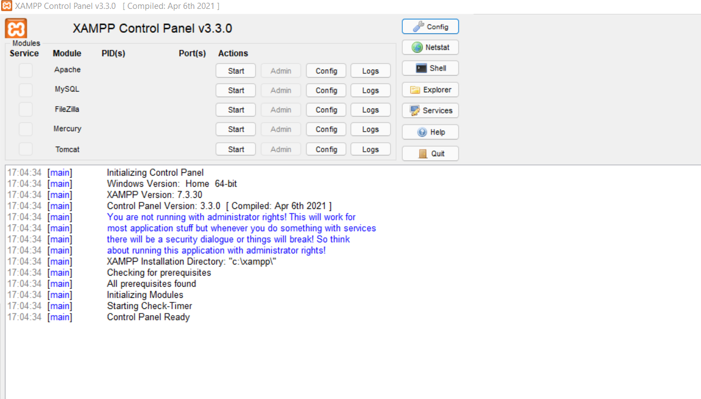
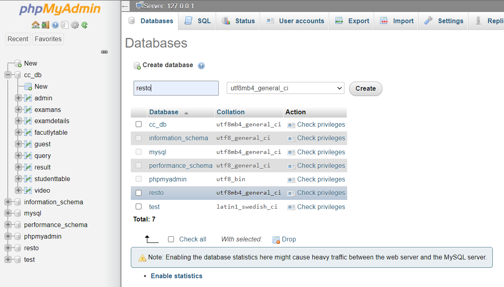
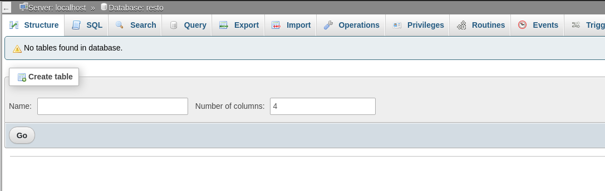
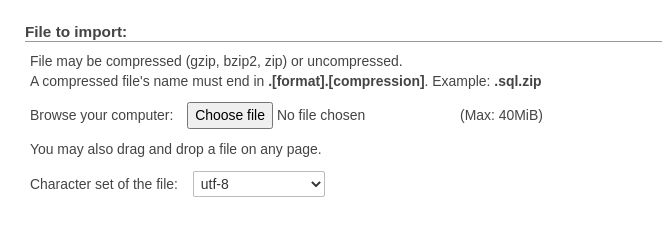

# Welcome to RestroBook - a table booking app

When you want to go out, but don't want to wait in a long line for booking a table, restrobook helps you with this in a moment of click. Now book a table at the nearest restaurant and get free reservation for 5 or less people. Our site helps you save your time, efforts and energy. 
Try it today. 

## Technologies Used 

<!-- 
 -->

**Client:** HTML, CSS, Bootstrap, JavaScript,JQuery, PHP, MySQL

**Server:** Apache

## Installation  Instructions
- Fork and give star ⭐ to this repository. 
- Clone the repository to the httdocs file of XAMP server. 
- After cloning, open XAMP and start MySQL and Apache Web Server.

- Open an internet browser and navigate to ` http://localhost/phpmyadmin/`
- Click on new and create Database as shown in below img:

- Click on Import db an `resto/sql` file which is given in repo.

- Open new tab and and type  `localhost/bluelearn`
- Select location.

## Screenshots

## Project Admin
<!-- 
  -->

|   | |  |   |
| :---: | :---: |:---:|:---:|
| **[Raja Harsh Vardhan Singh](https://github.com/RS2-Codes)**  | **[Raja Harsh Vardhan Singh](https://github.com/RS2-Codes)**  | **[Raja Harsh Vardhan Singh](https://github.com/RS2-Codes)**  | **[Raja Harsh Vardhan Singh](https://github.com/RS2-Codes)** | **[Raja Harsh Vardhan Singh](https://github.com/RS2-Codes)**  | **[Raja Harsh Vardhan Singh](https://github.com/RS2-Codes)**| 

